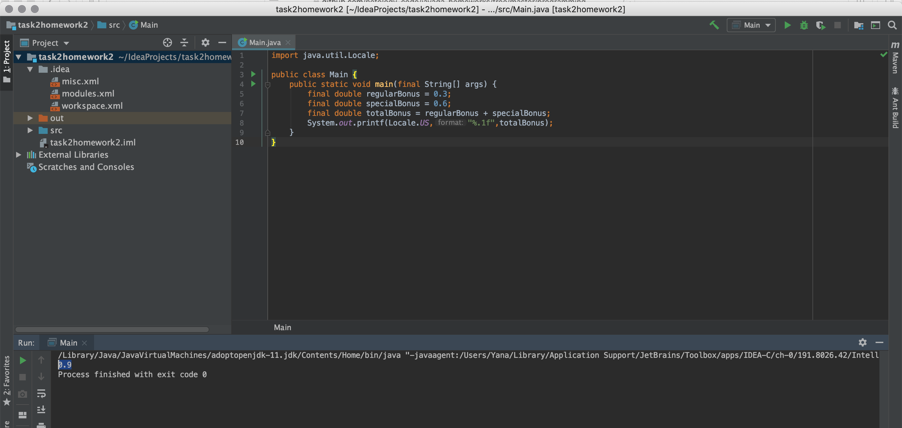

```
import java.util.Locale;

public class Main {
    public static void main(final String[] args) {
        final double regularBonus = 0.3;
        final double specialBonus = 0.6;
        final double totalBonus = regularBonus + specialBonus;
        System.out.printf(Locale.US,"%.1f",totalBonus);
    }
}
```

Run code result:

